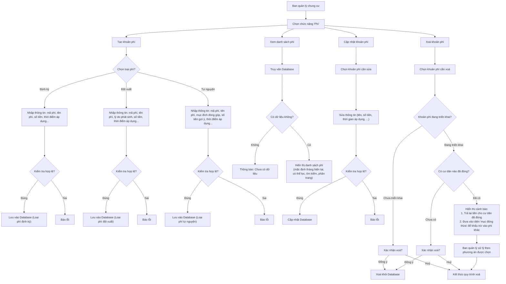

```mermaid
flowchart TD
    %% Entry
    n0["Ban quản lý chung cư"] --> n1["Chọn chức năng 'Phí'"]

    %% Create
    n1 --> n2["Tạo khoản phí"]
    n2 --> n3{"Chọn loại phí?"}

    %% Loại phí định kỳ
    n3 -- Định kỳ --> n4["Nhập thông tin: mã phí, tên phí, số tiền, thời điểm áp dụng..."]
    n4 --> n5{"Kiểm tra hợp lệ?"}
    n5 -- Đúng --> n6["Lưu vào Database (Loại phí định kỳ)"]
    n5 -- Sai --> n7["Báo lỗi"]

    %% Loại phí đột xuất
    n3 -- Đột xuất --> n8["Nhập thông tin: mã phí, tên phí, lý do phát sinh, số tiền, thời điểm áp dụng..."]
    n8 --> n9{"Kiểm tra hợp lệ?"}
    n9 -- Đúng --> n10["Lưu vào Database (Loại phí đột xuất)"]
    n9 -- Sai --> n11["Báo lỗi"]

    %% Loại phí tự nguyện
    n3 -- Tự nguyện --> n12["Nhập thông tin: mã phí, tên phí, mục đích đóng góp, số tiền gợi ý, thời điểm áp dụng..."]
    n12 --> n13{"Kiểm tra hợp lệ?"}
    n13 -- Đúng --> n14["Lưu vào Database (Loại phí tự nguyện)"]
    n13 -- Sai --> n15["Báo lỗi"]

    %% Read
    n1 --> n16["Xem danh sách phí"]
    n16 --> n17["Truy vấn Database"]
    n17 --> n18{"Có dữ liệu không?"}
    n18 -- Không --> n19["Thông báo: Chưa có dữ liệu"]
    n18 -- Có --> n20["Hiển thị danh sách phí<br>(mặc định tháng hiện tại, có thể lọc, tìm kiếm, phân trang)"]

    %% Update
    n1 --> n21["Cập nhật khoản phí"]
    n21 --> n22["Chọn khoản phí cần sửa"]
    n22 --> n23["Sửa thông tin (tên, số tiền, thời gian áp dụng, ...)"]
    n23 --> n24{"Kiểm tra hợp lệ?"}
    n24 -- Đúng --> n25["Cập nhật Database"]
    n24 -- Sai --> n26["Báo lỗi"]

     %% Delete
    n1 --> n27["Xoá khoản phí"]
    n27 --> n28["Chọn khoản phí cần xoá"]
    n28 --> n29{"Khoản phí đang triển khai?"}

    %% Nếu chưa triển khai
    n29 -- Chưa triển khai --> n30["Xác nhận xoá?"]
    n30 -- Đồng ý --> n31["Xoá khỏi Database"]
    n30 -- Huỷ --> n32["Giữ nguyên dữ liệu"]

    %% Nếu đang triển khai
    n29 -- Đang triển khai --> n33{"Có cư dân nào đã đóng?"}

    %% Trường hợp chưa ai đóng
    n33 -- Chưa có --> n34["Xác nhận xoá?"]
    n34 -- Đồng ý --> n31["Xoá khỏi Database"]
    n34 -- Huỷ --> n32["Giữ nguyên dữ liệu"]

    %% Trường hợp đã có cư dân đóng
    n33 -- Đã có --> n35["Hiển thị cảnh báo:<br>1. Trả lại tiền cho cư dân đã đóng<br>2. Đưa vào diện 'mục đóng thừa' để khấu trừ vào phí khác"]
    n35 --> n36["Ban quản lý xử lý theo phương án được chọn"]
    n36 --> n32["Kết thúc quy trình xoá"]

```
