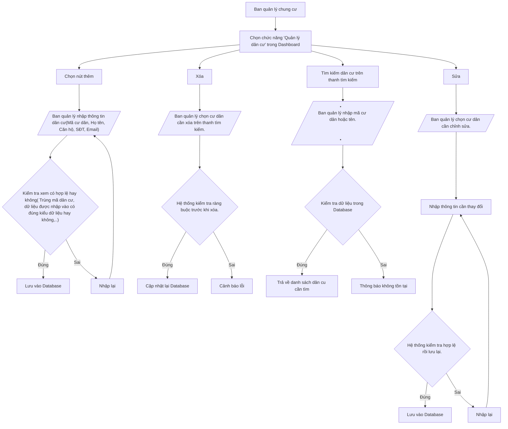

```mermaid
flowchart TD
    A["Ban quản lý chung cư"] --> P["Chọn chức năng 'Quản lý dân cư' trong Dashboard"]
    P --> B["Chọn nút thêm"] & n1["Sửa"] & n2["Xóa"] & n3["Tìm kiếm dân cư trên thanh tìm kiếm"]
    C{"Kiểm tra xem có hợp lệ hay không( Trùng mã dân cư, dữ liệu được nhập vào có đúng kiểu dữ liệu hay không,..)"} -- Đúng --> D["Lưu vào Database"]
    C -- Sai --> E["Nhập lại"]
    E --> n14
    n1 --> n5["Ban quản lý chọn cư dân cần chỉnh sửa."]
    n5 --> n5_0["Nhập thông tin cần thay đổi"]
    n5_0 ---> n6["Hệ thống kiểm tra hợp lệ rồi lưu lại."]
    n6 -- Đúng --> n7["Lưu vào Database"]
    n6 -- Sai --> n8["Nhập lại"]
    n8 --> n5_0
    n2 --> n9["Ban quản lý chọn cư dân cần xóa trên thanh tìm kiếm."]
    n9 --> n10["Hệ thống kiểm tra ràng buộc trước khi xóa."]
    n10 -- Đúng --> n11["Cập nhật lại Database"]
    n10 -- Sai --> n12["Cảnh báo lỗi"]
    n3 --> n13@{ label: "<li data-start=\"842\" data-end=\"882\"><p data-start=\"844\" data-end=\"882\">Ban quản lý nhập mã cư dân hoặc tên.</p>\n</li>\n<li data-start=\"883\" data-end=\"932\">\n<p data-start=\"885\" data-end=\"932\"></p></li>" }
    B --> n14@{ label: "<span style=\"background-color:\">Ban quản lý nhập thông tin dân cư(Mã cư dân, Họ tên, Căn hộ, SĐT, Email)</span>" }
    n14 --> C
    n13 --> n15["Kiểm tra dữ liệu trong Database"]
    n15 -- Đúng --> n16["Trả về danh sách dân cu cần tìm"]
    n15 -- Sai --> n17["Thông báo không tồn tại"]

    n5@{ shape: lean-r}
    n6@{ shape: diam}
    n9@{ shape: lean-r}
    n10@{ shape: diam}
    n13@{ shape: lean-r}
    n14@{ shape: lean-r}
    n15@{ shape: diam}
```
