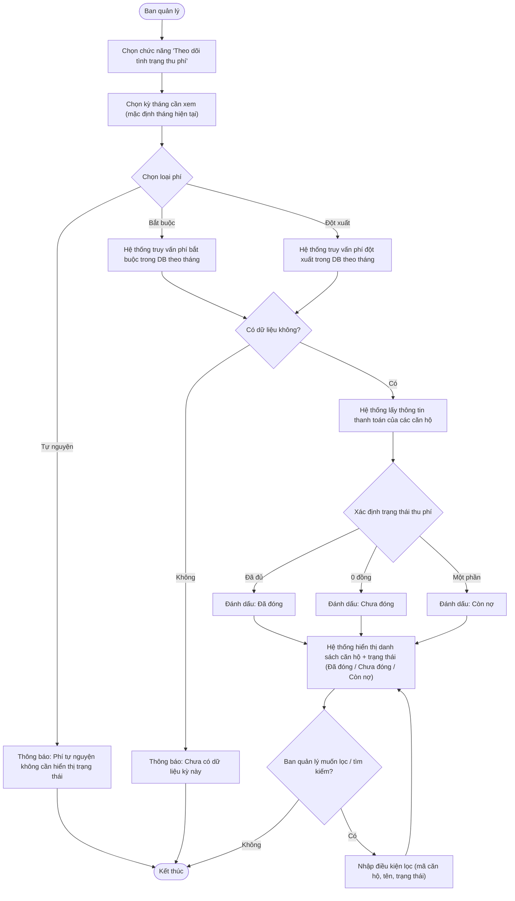

```mermaid
flowchart TD
    A([Ban quản lý]) --> C["Chọn chức năng 'Theo dõi tình trạng thu phí'"]
    C --> D["Chọn kỳ tháng cần xem (mặc định tháng hiện tại)"]
    D --> E{"Chọn loại phí"}
    E -- Bắt buộc --> F["Hệ thống truy vấn phí bắt buộc trong DB theo tháng"]
    E -- Đột xuất --> F2["Hệ thống truy vấn phí đột xuất trong DB theo tháng"]
    E -- Tự nguyện --> G0["Thông báo: Phí tự nguyện không cần hiển thị trạng thái"] --> Z([Kết thúc])

    F --> G{"Có dữ liệu không?"}
    F2 --> G

    G -- Không --> H["Thông báo: Chưa có dữ liệu kỳ này"] --> Z([Kết thúc])
    G -- Có --> I["Hệ thống lấy thông tin thanh toán của các căn hộ"]
    I --> J{"Xác định trạng thái thu phí"}
    J -- Đã đủ --> K["Đánh dấu: Đã đóng"]
    J -- 0 đồng --> L["Đánh dấu: Chưa đóng"]
    J -- Một phần --> M["Đánh dấu: Còn nợ"]

    K --> N
    L --> N
    M --> N

    N["Hệ thống hiển thị danh sách căn hộ + trạng thái (Đã đóng / Chưa đóng / Còn nợ)"]
    N --> O{"Ban quản lý muốn lọc / tìm kiếm?"}
    O -- Có --> P["Nhập điều kiện lọc (mã căn hộ, tên, trạng thái)"] --> N
    O -- Không --> Z([Kết thúc])


```
